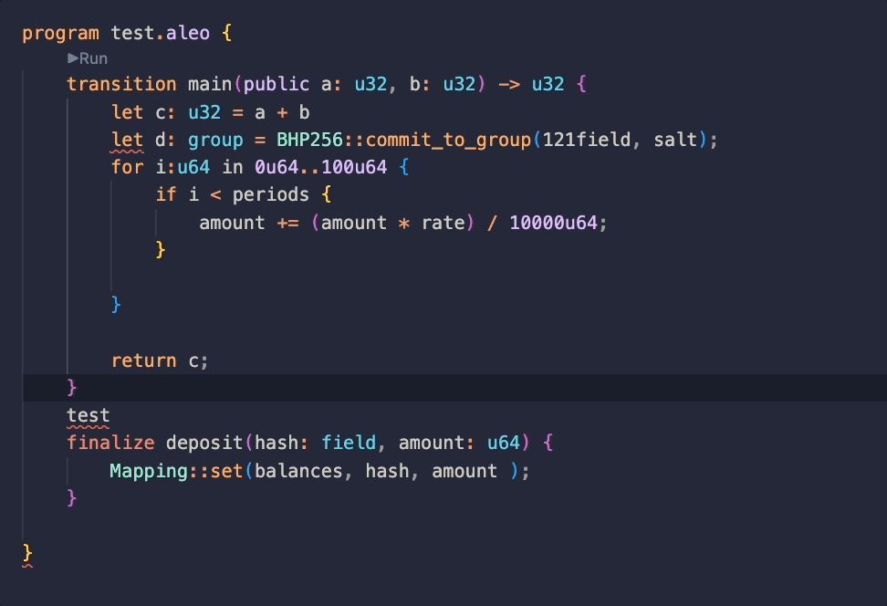
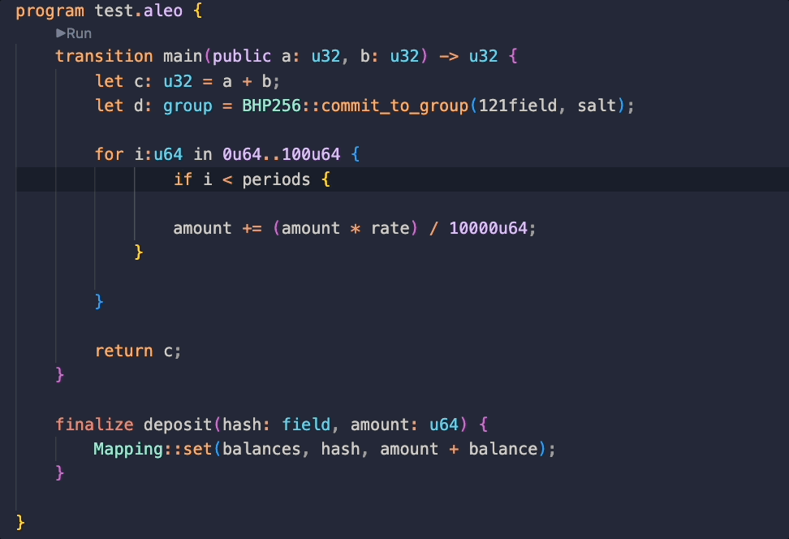
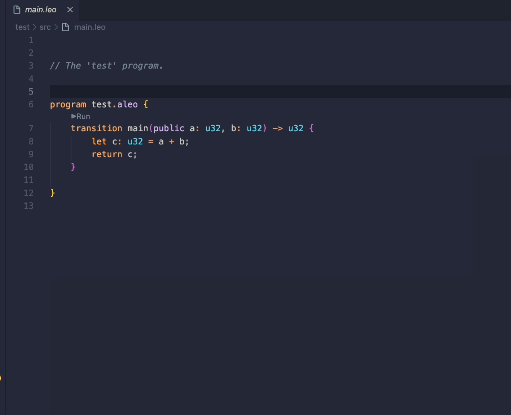

## 1. Overview

Leo&Aleo plugin is a vscode plugin that supports both Leo and Aleo language syntax detection, syntax highlighting, code formatting, code execution, and other functions. The theme color automatically switches with the vscode theme color.

## 2. Features for Leo Language

- language syntax detection
- language syntax highlighting
- code formatting
- code execution
- heme color automatically switches with the vscode theme color

## 3. Features for Aleo language

- language syntax detection
- lcoloranguage syntax highlighting
- code formatting
- code execution
- heme color automatically switches with the vscode theme 

## 4. Example

